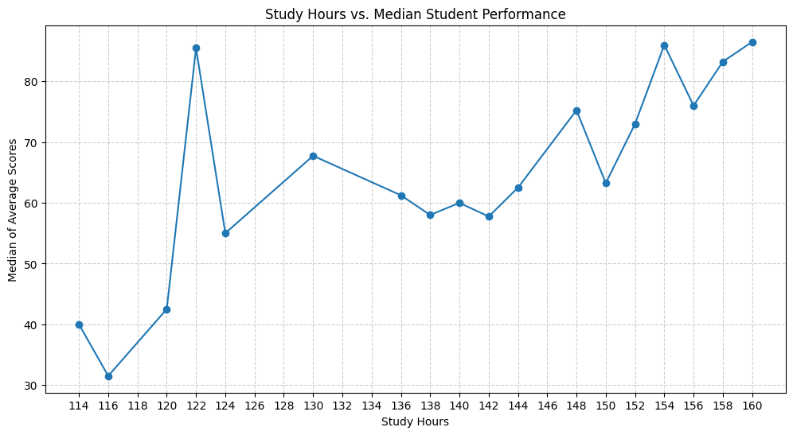
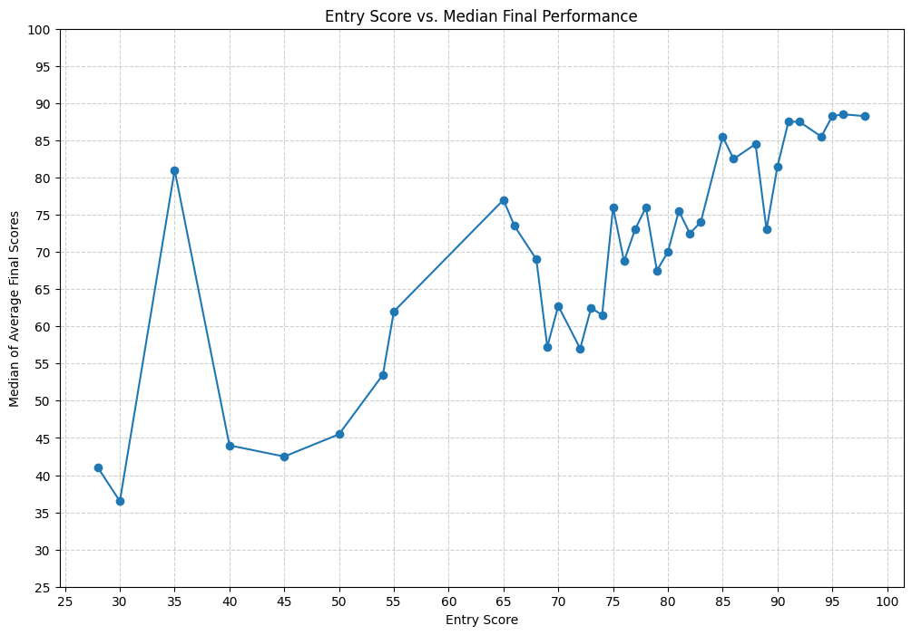
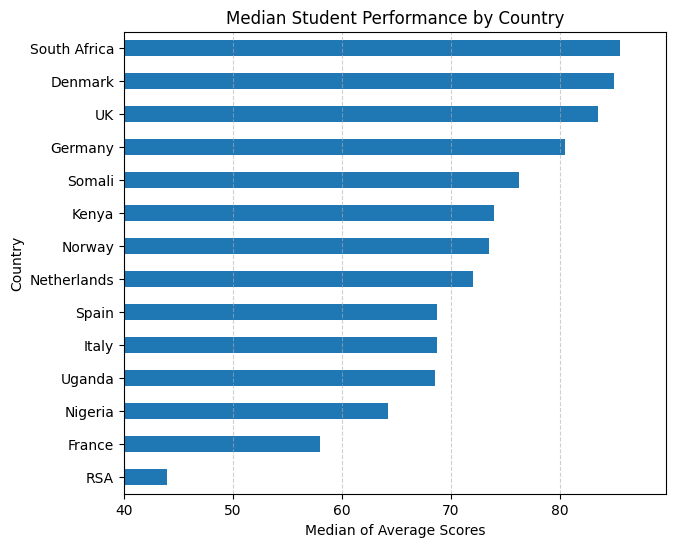
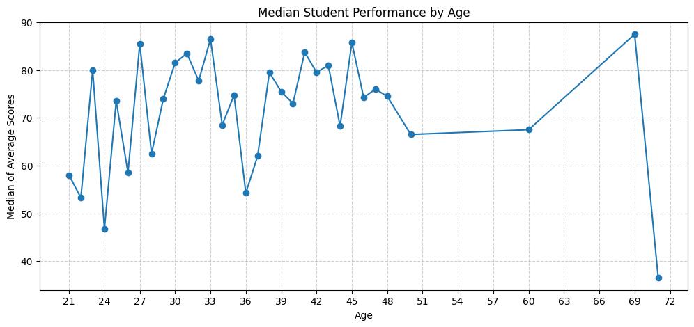
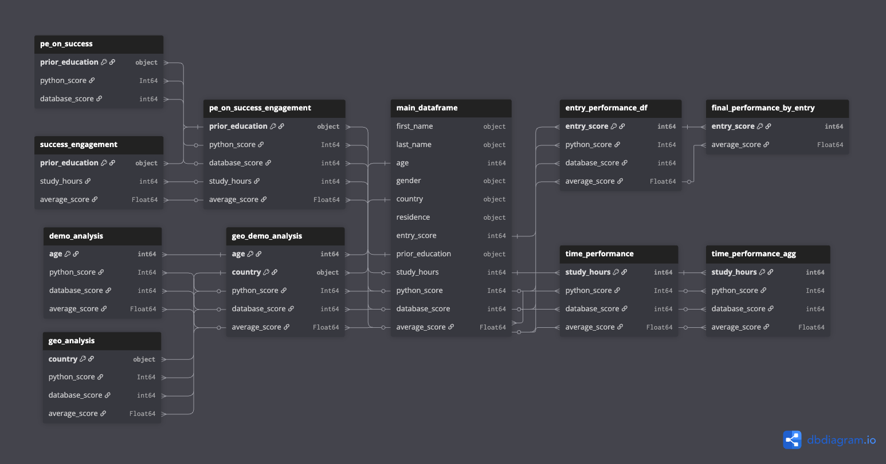

# Analysis of Student Performance to Drive Business Growth

## Executive Summary

This report outlines a data analysis project for **Data-Driven Decisions (DDD) Inc.**, a leading Ed-Tech company. Our objective was to analyze student performance data from our Python and Database courses to identify key factors influencing success. By understanding what drives student achievement, DDD Inc. can optimize its marketing strategies, personalize learning paths, and ultimately enhance student outcomes and business revenue.

### Key Findings:
1.  **Prior Education is a Strong Predictor of Success:** Students with higher levels of prior education consistently outperform others. Those with a **Doctorate** achieve the highest median Python score (**86.0**), which is **23% higher** than the median score for students with a **High School diploma (70.0)**.
2.  **Targeted Study Hours Correlate with Top Performance:** There is a clear positive correlation between time spent studying and final scores. Performance significantly increases with study hours, reaching a peak for students who invest **150-160 hours**, where median scores are consistently above **80%**.
3.  **Entry Score Reliably Forecasts Final Performance:** A student's initial entry score is a strong indicator of their final average score. The data shows a clear upward trend, where a student with an entry score of **90** is likely to achieve a final score near **85**, while a student with an entry score of **40** trends towards a median score of only **44**.
4.  **Performance Varies Geographically:** Student performance shows notable variation by country. Students from **South Africa** and **Denmark** are the top performers, achieving median final scores of **85.5** and **85.0**, respectively.

### Actionable Recommendations:
*   **Tiered Marketing & Onboarding:** Develop marketing campaigns targeting individuals with Bachelor's degrees or higher, highlighting advanced concepts. For applicants with only High School diplomas, implement a mandatory, automated "prep course" to bridge foundational gaps identified by their lower entry scores.
*   **Implement a Smart Notification System:** Integrate a proactive notification system within the learning platform to encourage students to reach the optimal **150-160 hour** study range. Trigger alerts when students' pacing indicates they will fall short of this target.
*   **Personalize Learning Paths Based on Entry Score:** Use the entry score to create personalized learning paths. Students scoring below **50** should be automatically enrolled in supplementary tutorials and assigned extra support resources to mitigate their higher risk of failure.

---

## 1. Business Problem & Objectives

Data-Driven Decisions (DDD) Inc. aims to solidify its market leadership by improving student success rates. To achieve this, we need to move beyond a one-size-fits-all approach and understand the specific attributes and behaviors of our most successful students. This project cleans and analyzes a raw dataset of student records to answer critical business questions that will inform product development, marketing, and student support initiatives.

### Key Business Questions:
> 1. Do users with different prior educational backgrounds achieve different levels of success with our product, and how does this correlate with their engagement?
> 2. Can a user's initial entry score predict their final performance in the Python and Database modules?
> 3. How does the number of study hours a user invests correlate with their performance? Is there a point of diminishing returns?
> 4. Are there significant differences in performance based on a user's country or age?

---

## 2. Key Insights & Analysis

### Insight 1: Prior Education Directly Impacts Exam Performance

Our analysis reveals a strong, positive correlation between a student's level of prior education and their median exam scores. Students with more advanced degrees consistently achieve higher scores in both Python and Database modules.


This trend indicates that students from more rigorous academic backgrounds are better equipped for the challenges of our courses. The performance gap is most significant between university-educated students (Bachelors and above) and those with vocational or secondary education.

**Median Exam Scores by Prior Education:**

| prior_education | python_score | database_score |
| :-------------- | :------------- | :--------------- |
| Doctorate       | 86.0           | 77.0             |
| Masters         | 84.5           | 83.0             |
| Bachelors       | 81.0           | 69.0             |
| Diploma         | 75.0           | 74.5             |
| High School     | 70.0           | 59.0             |

This trend indicates that students from more rigorous academic backgrounds are better equipped for the challenges of our courses. The performance gap is most significant between university-educated students (Bachelors and above) and those with vocational or secondary education.

### Insight 2: A Strong Positive Correlation Exists Between Study Hours and Scores

Engagement, measured in study hours, is a critical driver of success. The analysis shows that as study hours increase, the average final score also increases significantly.



The data indicates that students who study for 150-160 hours achieve the highest median scores, generally above 80%. Conversely, students studying fewer than 120 hours see a sharp drop in performance, with median scores falling as low as 31.5%. This suggests a "sweet spot" of engagement that is strongly associated with top-tier performance.


### Insight 3: Entry Score is a Powerful Predictor of Final Performance

The initial entry score serves as a reliable forecast for a student's final average score. The trend is clear and positive: the higher the entry score, the higher the median final score.



-   Students with an entry score of **25** had a median final score of approximately **45**.
-   This rises steadily, with an entry score of **70** corresponding to a median final score of **73**.
-   Top-tier students with entry scores of **90+** achieved median final scores of **85** or higher.

This strong linear relationship confirms that the initial assessment is an effective tool for identifying students who may be at risk and require additional support.

### Insight 4: Performance Varies Across Geographic and Demographic Segments

While not as strong as other factors, geography and age do show some correlation with performance.

-   **Geographic Analysis:** Performance varies significantly by country. Top-performing students tend to come from **South Africa (median score: 85.5)** and **Denmark (85.0)**, while students from **RSA (44.0)** and **France (58.0)** had the lowest median scores. This could inform targeted marketing or region-specific support strategies.



-   **Demographic Analysis (Age):** There is a general upward trend in performance with age, peaking around age **40-45**. However, the relationship is less pronounced than with other factors, suggesting that motivation and background are more critical than age alone. The cohort of students aged **60+** also performed exceptionally well, indicating that the course is effective for learners at all career stages.



---

## 3. Data Structure (Entity-Relationship Diagram)

The project utilized a single, cleaned dataset (`main_student_data.csv`) derived from a raw source. The data is structured as a flat table, as illustrated in the ERD below.



---

## 4. Limitations & Future Work

### Limitations
-   **Sample Size:** The analysis was conducted on a small dataset of only 77 student records. This limits the statistical significance of the findings, which should be treated as directional indicators rather than definitive conclusions.
-   **Data Imputation:** Missing values in the `python_score` column were imputed using the `database_score`. While a pragmatic approach, this assumes a perfect correlation that may not exist, potentially skewing the results.
-   **Correlation vs. Causation:** This analysis identifies strong correlations (e.g., study hours and score) but does not prove causation. Other confounding factors not present in the dataset could be influencing student performance.

### Future Work
-   **Expand Dataset:** The highest priority is to collect more data to validate these initial findings on a larger and more statistically robust sample.
-   **Predictive Modeling:** Develop a regression model to predict a student's final score based on input variables like entry score, prior education, and age. This could power a proactive "at-risk student" identification system.
-   **A/B Testing Recommendations:** Implement the proposed recommendations (e.g., the smart notification system) as A/B tests to directly measure their impact on student success and completion rates.

---

## 5. Technical Appendix

### Data Source & Cleaning
The analysis was performed on a raw CSV file, `bi.csv`. The data underwent a rigorous cleaning and standardization process using Python and the `pandas` library, which included:
-   Standardizing all column names to a consistent snake_case format.
-   Cleaning and standardizing categorical data in the `gender`, `country`, `residence`, and `prior_education` columns to correct typos and ensure consistency.
-   Imputing `NaN` values in the `python_score` column with the corresponding `database_score` value.
-   Converting data types to their appropriate format (e.g., `python_score` to `Int64`).
-   Performing a final sweep to replace common null-value strings (`'nan'`, `'NULL'`) with `numpy.nan`.
-   The cleaned data was saved to `main_student_data.csv`.

### Tools & Libraries
-   **Python 3.13.5**
-   **Pandas:** For data manipulation and cleaning.
-   **NumPy:** For numerical operations and handling `NaN` values.
-   **Matplotlib:** For data visualization.

### Setup & Installation
To replicate this analysis, clone the repository and install the required libraries:
```bash
# Clone the repository
git clone <repository_url>
cd <repository_name>

# Install required packages
pip install pandas numpy matplotlib
```

## 📬 Contact
**Selim Najaf**

*   **LinkedIn:** [linkedin.com/in/selimnajaf-data-analyst](https://www.linkedin.com/in/selimnajaf-data-analyst/)
*   **GitHub:** [github.com/SelimNajaf](https://github.com/SelimNajaf)
